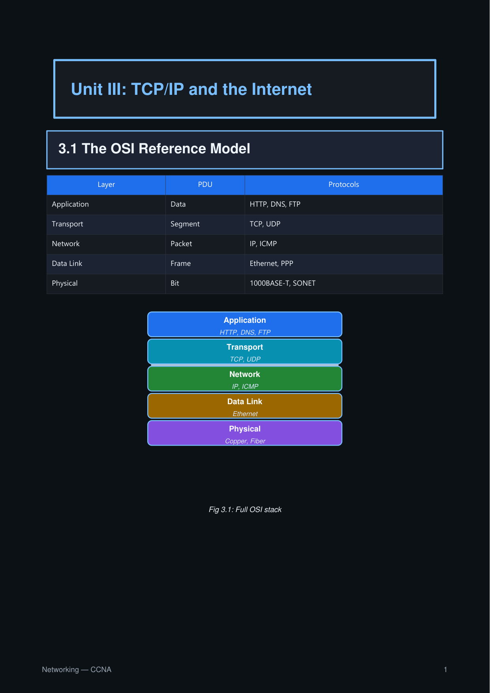

# Example: Networking Notes

Networking notes using OSI-layer stacks, packet header diagrams, and sequence diagrams to show the stack holistically.

```python title="networking_notes.py"
import engrapha_notes as en
import engrapha_diagrams as ed

en.set_theme(en.DARK)
en.set_global_footer(left="Networking — CCNA", show_page_num=True)

en.part_box("Unit III: TCP/IP and the Internet")
en.chap_box("3.1 The OSI Reference Model")

# HTML table of layers
en.info_table(
    headers=["Layer", "PDU", "Protocols"],
    rows=[
        ["Application", "Data",   "HTTP, DNS, FTP"],
        ["Transport",   "Segment", "TCP, UDP"],
        ["Network",     "Packet", "IP, ICMP"],
        ["Data Link",   "Frame",   "Ethernet, PPP"],
        ["Physical",    "Bit",    "1000BASE-T, SONET"],
    ],
    col_widths=["30%", "20%", "50%"],
)

# Stack diagram
stack = ed.LayeredStack(
    width=260, height=240,
    caption="Fig 3.1: Full OSI stack"
)
stack.layer("Application", sublabel="HTTP, DNS, FTP")
stack.layer("Transport",   sublabel="TCP, UDP")
stack.divider()
stack.layer("Network",     sublabel="IP, ICMP")
stack.layer("Data Link",   sublabel="Ethernet")
stack.layer("Physical",    sublabel="Copper, Fiber")

en.add(stack.as_flowable())

# Illustration: Three-way handshake
en.chap_box("3.2 The TCP Handshake")

seq = ed.SequenceDiagram(
    width=430, height=180,
    caption="Fig 3.2: Three-way handshake",
)
seq.actor("cl", "Client")
seq.actor("srv", "Server")
seq.message("cl", "srv", "SYN, ISN=c")
seq.message("srv", "cl", "SYN-ACK, ISN=s, ACK=c+1", arrow="dashed")
seq.message("cl", "srv", "ACK, ACK=s+1", arrow="dashed")

en.add(seq.as_flowable())

en.build_doc("networking_notes.pdf")
```



