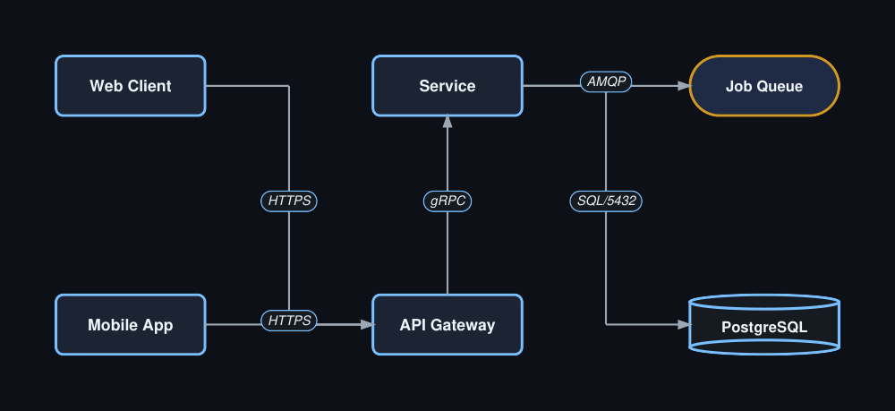
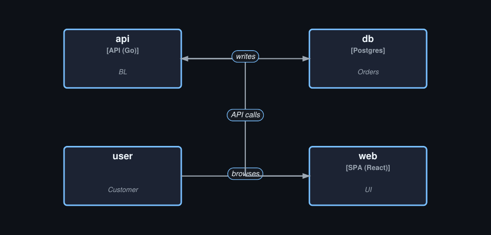
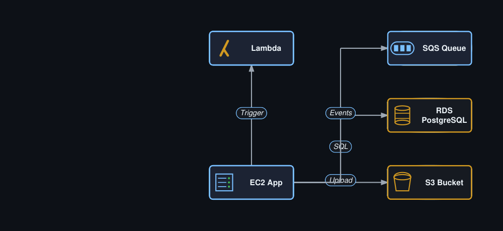

# Gallery: Architecture Diagrams

System architecture and cloud topology examples.

## Horizontal architecture

```python title="arch_h.py"
import paperforge_notes as pn
import paperforge_diagrams as pd

arch = pd.ArchitectureDiagram(
    width=480, height=220,
    orientation="horizontal",
    caption="Fig 10: Web Application",
)

arch.client("web",  "Web Client")
arch.client("mob",  "Mobile App")
arch.service("gw",  "API Gateway")
arch.service("svc", "Service")
arch.database("db", "PostgreSQL")
arch.queue("q",    "Job Queue")

arch.connect("web",  "gw",   "HTTPS")
arch.connect("mob",  "gw",   "HTTPS")
arch.connect("gw",   "svc",  "gRPC")
arch.connect("svc",  "db",   "SQL/5432")
arch.connect("svc",  "q",    "AMQP")

pn.add(arch.as_flowable())
```



## C4 container view

```python title="arch_c4.py"
import paperforge_notes as pn
import paperforge_diagrams as pd

c4 = pd.C4ContainerDiagram(
    width=460, height=220,
    caption="Fig 11: Shop System - C4",
)
c4.system("user",  "Customer")
c4.container("web", "SPA (React)", "UI")
c4.container("api", "API (Go)",    "BL")
c4.container("db",  "Postgres",    "Orders")

c4.relate("user", "web", "browses")
c4.relate("web",  "api", "API calls")
c4.relate("api",  "db",  "writes")

pn.add(c4.as_flowable())
```



## AWS stack

```python title="arch_aws.py"
import paperforge_notes as pn
import paperforge_diagrams as pd

aws = pd.AWSDiagram(
    width=480, height=220, orientation="horizontal",
    caption="Fig 12: AWS Infrastructure",
)

aws.ec2("app",    "EC2 App")
aws.rds("db",     "RDS PostgreSQL")
aws.s3("assets",  "S3 Bucket")
aws.sqs("queue",  "SQS Queue")
aws.lambda_fn("fn", "Lambda")

aws.connect("app",   "db",     "SQL")
aws.connect("app",   "assets", "Upload")
aws.connect("app",   "queue",  "Events")
aws.connect("app",   "fn",     "Trigger")

pn.add(aws.as_flowable())
```



## Next

- [Themes](themes.md)
