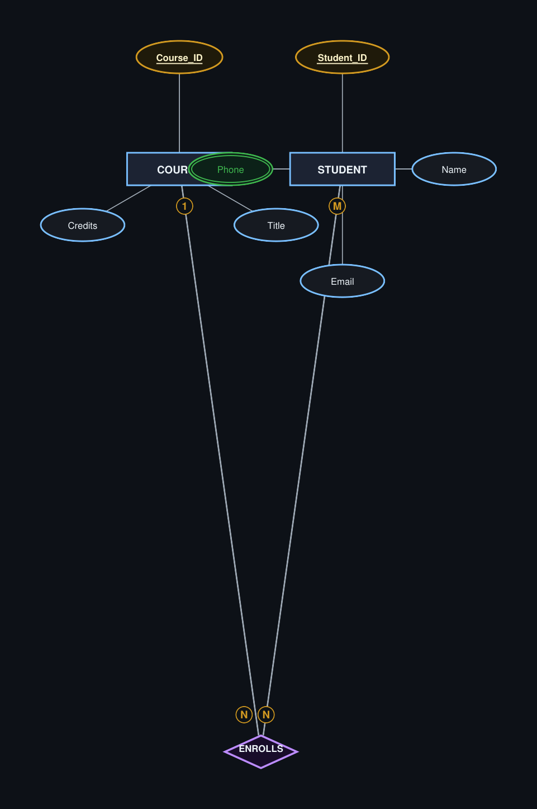
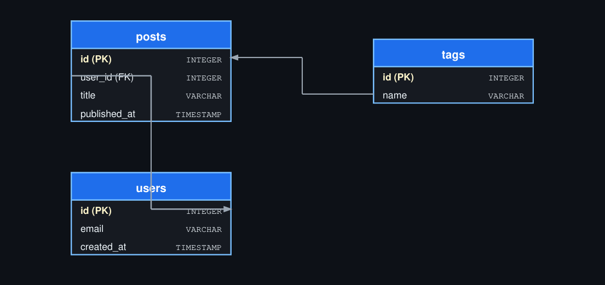

# Gallery: ER Diagrams

ER and Schema diagrams built with the Chen and SQL table notations.

## Entity-Relationship (Chen)

```python title="er_chen.py"
import paperforge_notes as pn
import paperforge_diagrams as pd

er = pd.ERDiagram(
    width=550, height=260,
    caption="Fig 4: University ER"
)

er.entity("STUDENT")
er.entity("COURSE")
er.relationship("ENROLLS")

er.entity_attributes(
    "STUDENT",
    [("Student_ID", {"pk": True}), "Name", "Email", ("Phone", {"multivalued": True})],
)
er.entity_attributes("COURSE", [("Course_ID", {"pk": True}), "Title", "Credits"])

er.connect("STUDENT", "ENROLLS", card_from="M", card_to="N", total_from=False, total_to=True)
er.connect("COURSE", "ENROLLS", card_from="1", card_to="N")

pn.add(er.as_flowable())
```



## Database schema

```python title="er_schema.py"
import paperforge_notes as pn
import paperforge_diagrams as pd

schema = pd.SchemaDiagram(
    width=530, height=250,
    caption="Fig 5: Blog Schema"
)

schema.table("users", [
    ("id",          "INTEGER", {"pk": True}),
    ("email",       "VARCHAR", {}),
    ("created_at",  "TIMESTAMP", {}),
])
schema.table("posts", [
    ("id",           "INTEGER",  {"pk": True}),
    ("user_id",      "INTEGER",  {"fk": True}),
    ("title",        "VARCHAR",  {}),
    ("published_at", "TIMESTAMP", {}),
])
schema.table("tags", [
    ("id",    "INTEGER",  {"pk": True}),
    ("name",  "VARCHAR",  {}),
])
schema.relation("posts",  "user_id", "users",  "id")
schema.relation("tags",   "name",    "posts",  "id")

pn.add(schema.as_flowable())
```



## Next

- [Sequence Diagrams](sequence-diagrams.md)
- [Network Diagrams](network-diagrams.md)
