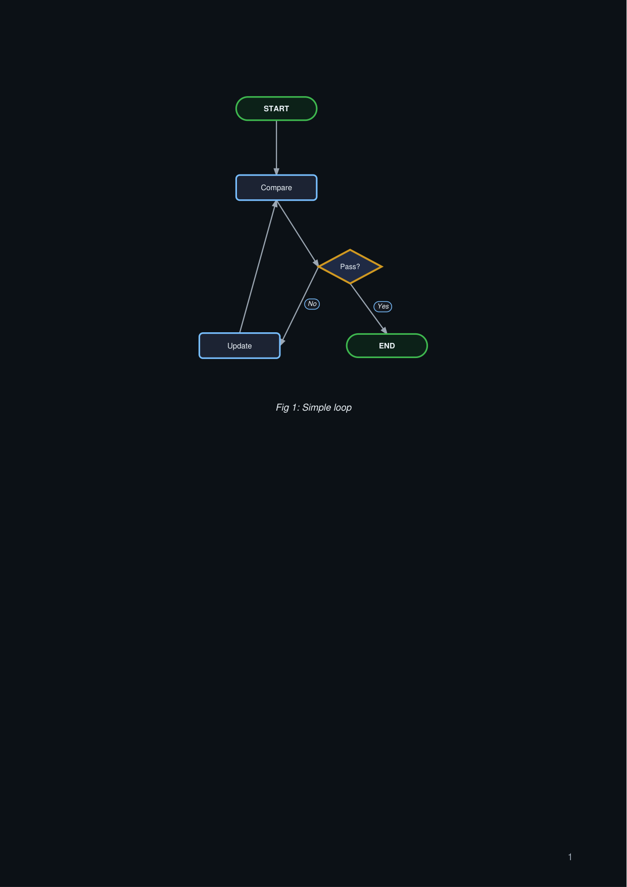
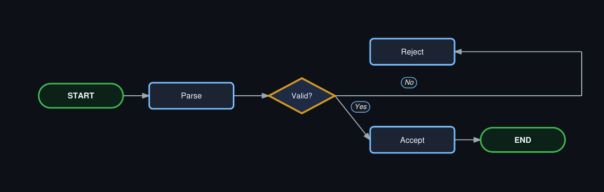
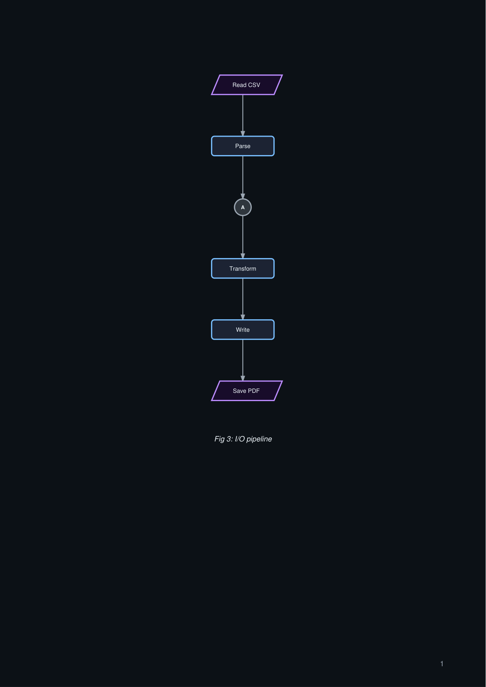

# Gallery: Flowcharts

Flowcharts are the most frequently used diagram type in Engrapha. This page shows standard variations.

## Plain loop

```python title="flow_loop.py"
import engrapha_notes as en
import engrapha_diagrams as ed

fc = ed.Flowchart(width=480, height=240, caption="Fig 1: Simple loop")
fc.terminal("s", "START")
fc.process("cmp", "Compare")
fc.decision("chk", "Pass?")
fc.process("log", "Update")
fc.terminal("e", "END")
fc.edge("s", "cmp")
fc.edge("cmp", "chk")
fc.edge("chk", "e", branch="yes")
fc.edge("chk", "log", branch="no")
fc.edge("log", "cmp")

en.add(fc.as_flowable())
```



## Decision branch with orthogonal routing

```python title="flow_branch.py"
import engrapha_notes as en
import engrapha_diagrams as ed

fc = ed.Flowchart(
    width=500, height=240, direction="LR",
    caption="Fig 2: Conditional branch",
)
fc.terminal("s", "START")
fc.process("p", "Parse")
fc.decision("c", "Valid?")
fc.process("ok", "Accept")
fc.process("no", "Reject")
fc.terminal("e", "END")
fc.edge("s", "p")
fc.edge("p", "c")
fc.edge("c", "ok", branch="yes")
fc.edge("c", "no", branch="no", orthogonal=True)
fc.edge("ok", "e")

en.add(fc.as_flowable())
```



## I/O and connectors

```python title="flow_io.py"
import engrapha_notes as en
import engrapha_diagrams as ed

fc = ed.Flowchart(width=520, height=260, caption="Fig 3: I/O pipeline")
fc.io_box("in", "Read CSV")
fc.process("p", "Parse")
fc.connector("ref", "A")
fc.process("c", "Transform")
fc.process("w", "Write")
fc.io_box("out", "Save PDF")
fc.edge("in", "p")
fc.edge("p", "ref")
fc.edge("ref", "c")
fc.edge("c", "w")
fc.edge("w", "out")

en.add(fc.as_flowable())
```



## Next

- [ER Diagrams](er-diagrams.md)
- [Sequence Diagrams](sequence-diagrams.md)

