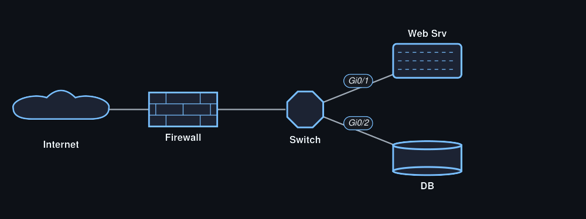
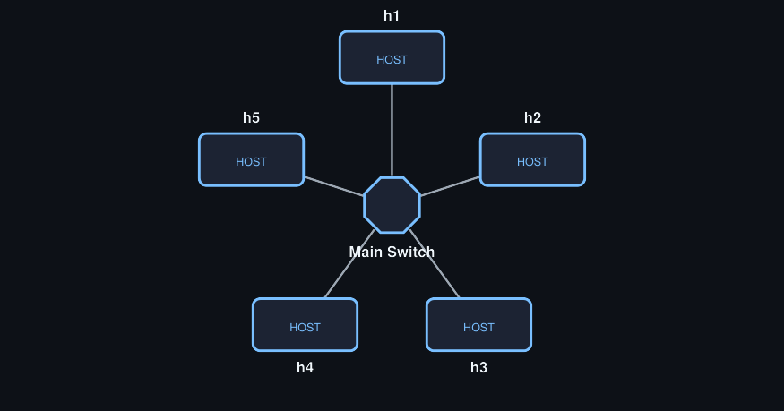
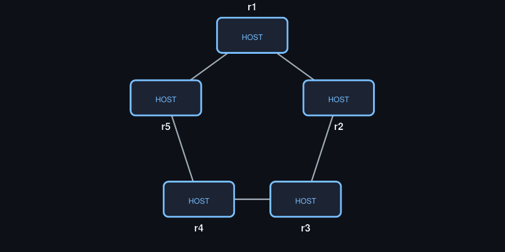
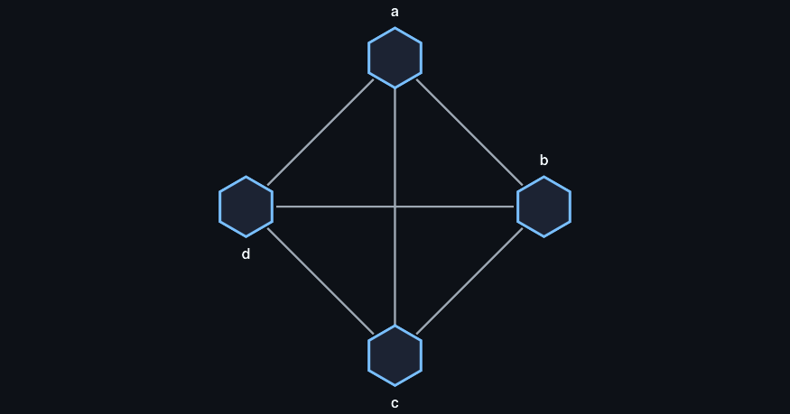

# Gallery: Network Diagrams

Network topology examples: simple LAN, bus topology, star, mesh, and tree.

## Simple LAN

```python title="net_lan.py"
import paperforge_notes as pn
import paperforge_diagrams as pd

net = pd.NetworkDiagram(width=480, height=180, caption="Fig 9: LAN Deployment")

net.node("inet",  "Internet", x=50,  y=90,  kind="cloud")
net.node("fw",    "Firewall", x=150, y=90,  kind="firewall")
net.node("sw",    "Switch",   x=250, y=90,  kind="switch")
net.node("srv",   "Web Srv",  x=350, y=130, kind="server")
net.node("db",    "DB",       x=350, y=50,  kind="database")

net.link("inet", "fw")
net.link("fw",   "sw")
net.link("sw",   "srv",  label="Gi0/1")
net.link("sw",   "db",   label="Gi0/2")

pn.add(net.as_flowable())
```



## Star topology

```python title="net_star.py"
import paperforge_notes as pn
import paperforge_diagrams as pd

net = pd.NetworkDiagram(width=420, height=220)
net.star_topology(
    center_id="sw",
    center_label="Main Switch",
    spoke_ids=["h1", "h2", "h3", "h4", "h5"],
)

pn.add(net.as_flowable())
```



## Ring topology

```python title="net_ring.py"
import paperforge_notes as pn
import paperforge_diagrams as pd

net = pd.NetworkDiagram(width=400, height=200)
net.ring_topology(["r1", "r2", "r3", "r4", "r5"])

pn.add(net.as_flowable())
```



## Full mesh

```python title="net_mesh.py"
import paperforge_notes as pn
import paperforge_diagrams as pd

net = pd.NetworkDiagram(width=420, height=220)
net.mesh_topology(["a", "b", "c", "d"], kind="router")

pn.add(net.as_flowable())
```



## Next

- [Architecture Diagrams](architectures.md)
