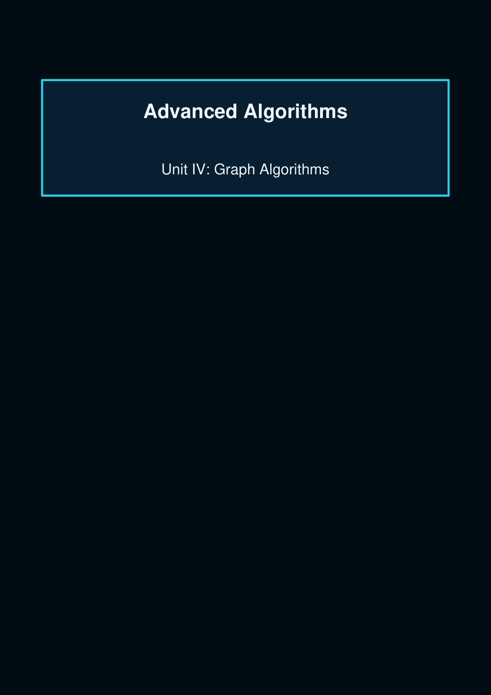
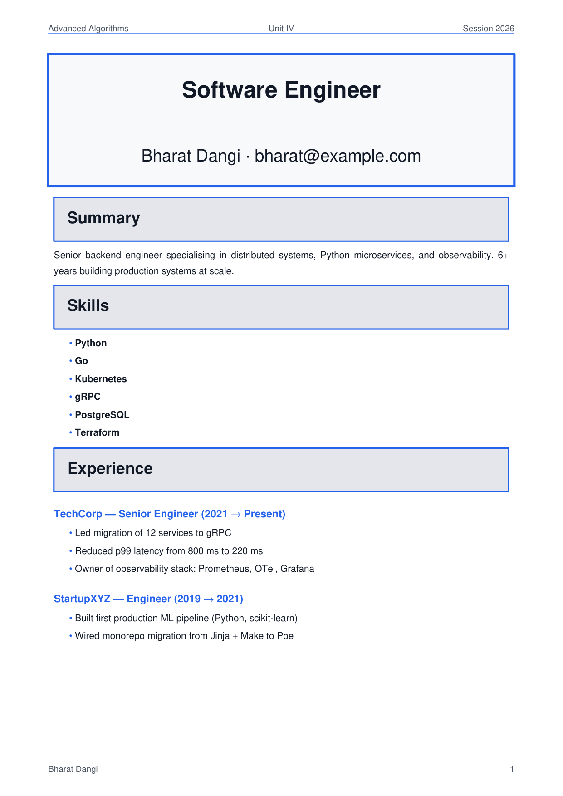
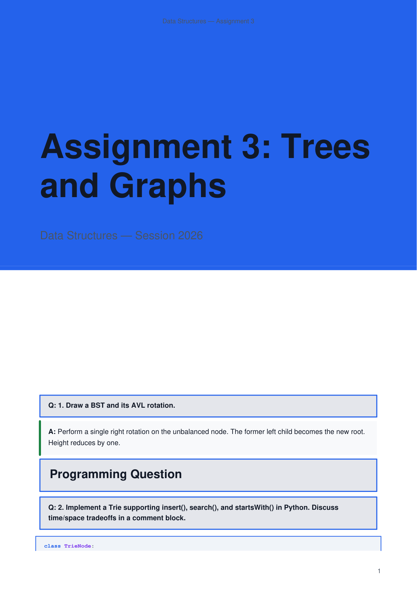
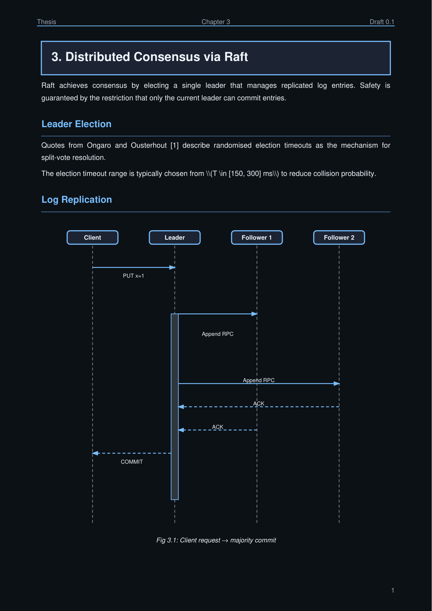

# Gallery: Notes Pages

Full page screenshots of notes documents generated by Engrapha. Each entry shows a representative document-type alongside the Python that generates it.

## Engineering notes

See [Engineering Notes example](../examples/engineering-notes.md).

## Resume

See [Resume example](../examples/resume.md).

## Assignment / worksheet

See [Assignment example](../examples/assignment.md).

## Thesis page

See [Thesis example](../examples/thesis.md).

## Next

- [Examples index](../examples/engineering-notes.md)

