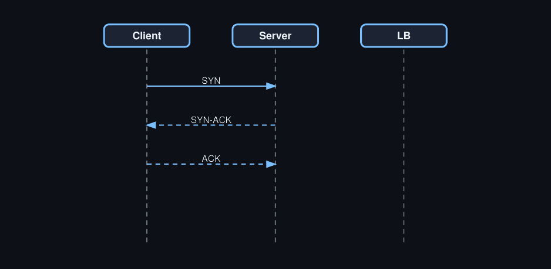
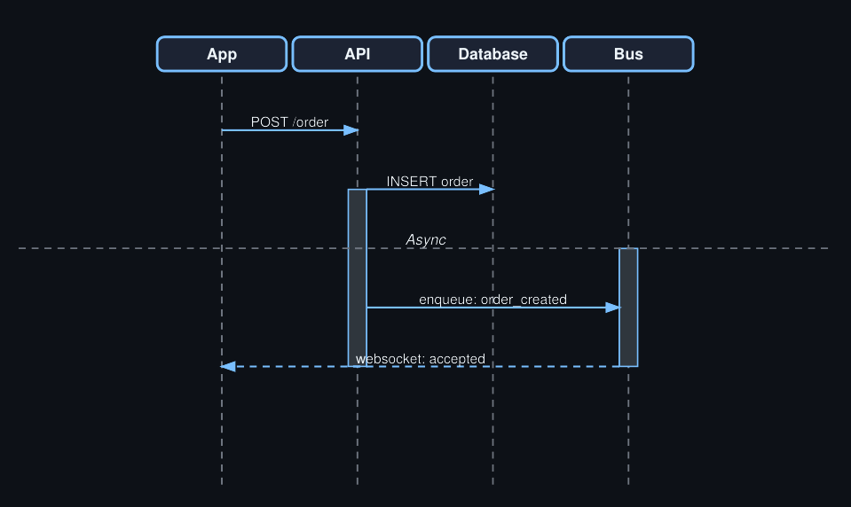
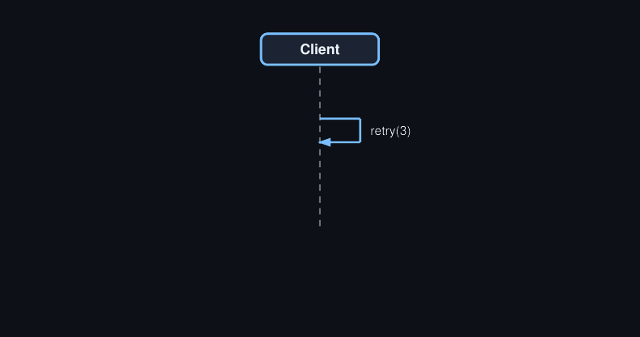

# Gallery: Sequence Diagrams

Sequence diagrams express API calls, handshake protocols, and event ordering.

## Basic handshake

```python title="seq_handshake.py"
import paperforge_notes as pn
import paperforge_diagrams as pd

seq = pd.SequenceDiagram(
    width=450, height=220,
    caption="Fig 6: Three-way handshake",
)

seq.actor("cl",    "Client")
seq.actor("srv",   "Server")
seq.actor("proxy", "LB")

seq.message("cl",    "srv",   "SYN")
seq.message("srv",   "cl",    "SYN-ACK",  arrow="dashed")
seq.message("cl",    "srv",   "ACK",      arrow="dashed")

pn.add(seq.as_flowable())
```



## Async processing with activation bars

```python title="seq_async.py"
import paperforge_notes as pn
import paperforge_diagrams as pd

seq = pd.SequenceDiagram(
    width=460, height=240,
    caption="Fig 7: Async order flow",
)

seq.actor("app",  "App")
seq.actor("api",  "API")
seq.actor("db",   "Database")
seq.actor("bus",  "Bus")

seq.message("app", "api", "POST /order")
seq.activate("api")
seq.message("api", "db",  "INSERT order")
seq.activate("bus")
seq.divider("Async")
seq.message("api", "bus", "enqueue: order_created")
seq.deactivate("bus")
seq.deactivate("api")
seq.message("bus", "app",  "websocket: accepted", arrow="dashed")

pn.add(seq.as_flowable())
```



## Self-message

```python title="seq_self.py"
import paperforge_notes as pn
import paperforge_diagrams as pd

seq = pd.SequenceDiagram(
    width=380, height=200, caption="Fig 8: Retry loop"
)
seq.actor("client", "Client")
seq.message("client", "client", "retry(3)")
pn.add(seq.as_flowable())
```



## Next

- [Network Diagrams](network-diagrams.md)
- [Architecture Diagrams](architectures.md)
