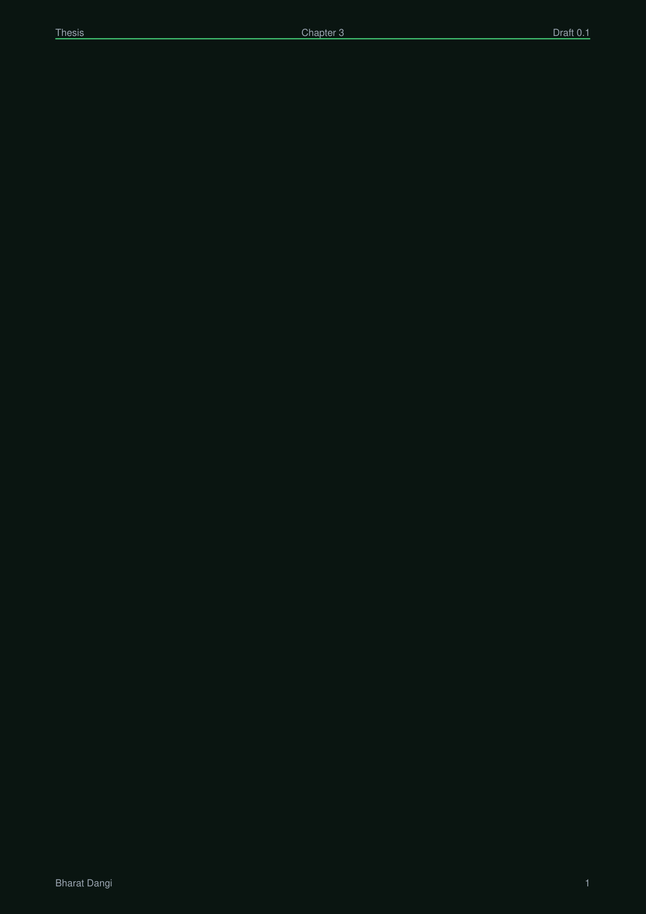

# Gallery: Themes

The same diagram rendered in every preset PaperForge theme. This page shows the power and clean auto-matching of the theme system.

Set up:

```python title="gallery_themes.py"
import paperforge_notes as pn
import paperforge_diagrams as pd

fc = pd.Flowchart(width=340, height=180)
fc.terminal("s", "START").process("w", "Work").terminal("e", "END")
fc.edge("s", "w").edge("w", "e")

for tname, theme in [
    ("DARK",             pn.DARK),
    ("LIGHT",            pn.LIGHT),
    ("OCEAN_DARK",       pn.OCEAN_DARK),
    ("FOREST_DARK",      pn.FOREST_DARK),
    ("SUNSET_DARK",      pn.SUNSET_DARK),
    ("MIDNIGHT_DARK",    pn.MIDNIGHT_DARK),
    ("OCEAN_LIGHT",      pn.OCEAN_LIGHT),
    ("SEPIA",            pn.SEPIA),
    ("CATPPUCCIN_LATTE", pn.CATPPUCCIN_LATTE),
    ("CATPPUCCIN_MOCHA", pn.CATPPUCCIN_MOCHA),
]:
    pn.set_theme(theme)
    diag_t = pd.DiagramTheme.from_notes_theme(pn.get_theme())
    fc2 = pd.Flowchart(width=340, height=180, theme=diag_t, caption=f"Theme: {tname}")
    fc2.terminal("s", "START").process("w", "Work").terminal("e", "END")
    fc2.edge("s", "w").edge("w", "e")
    pn.add(fc2.as_flowable())
    pn.sp(6)

pn.build_doc("gallery_themes.pdf")
```

## Theme comparison grid

| Theme | Background | Accent |
| ----- | --------- | ----- |
| DARK | `#0d1117` | `#79c0ff` |
| LIGHT | `#ffffff` | `#2563eb` |
| OCEAN_DARK | `#020c14` | `#22d3ee` |
| FOREST_DARK | `#0b1512` | `#4ade80` |
| SUNSET_DARK | `#0c0811` | `#fb923c` |
| MIDNIGHT_DARK | `#07050f` | `#818cf8` |
| OCEAN_LIGHT | `#f0f9ff` | `#0891b2` |
| SEPIA | `#faf7f0` | `#92400e` |
| CATPPUCCIN_LATTE | `#eff1f5` | `#1e66f5` |
| CATPPUCCIN_MOCHA | `#1e1e2e` | `#89b4fa` |



## Next

- [Notes pages](notes-pages.md)
- [Examples](../examples/engineering-notes.md)
